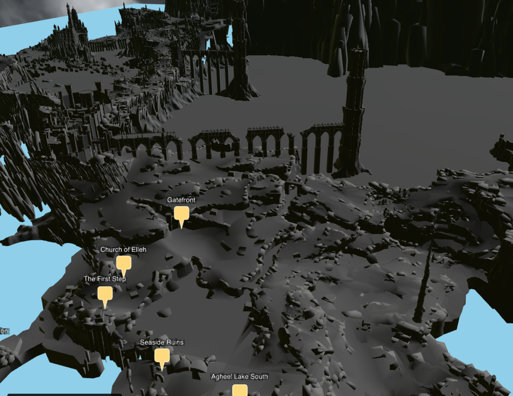

# Elden Ring 3D Map

An interactive 3D map of the Lands Between built with CesiumJS, rendering the Elden Ring overworld as a navigable 3D tileset with annotated Sites of Grace.



---

## Features

IN PROGRESS

- **Full 3D overworld** — the Lands Between rendered as a 3D Tiles tileset with real terrain geometry
- **Sites of Grace markers** — 170+ locations across Limgrave, Liurnia, Caelid, Altus Plateau, and more, displayed as billboard pins with distance-based visibility
- **Skyboxes** — randomly selected in-game skybox environments (Gravesite Plain, Siofra River, Cerulean Coast, and others)
- **Configurable lighting** — directional light with direction and intensity tunable from `config.json`
- **Ground plane** — a reference plane under the geometry to anchor camera zoom and pan behavior
- **Debug mode** — origin marker, light source gizmo, and a click-to-pick overlay showing world and local coordinates (dev only)

---

## Tech Stack

| Tool | Purpose |
| --- | --- |
| [React 19](https://react.dev) | UI shell and component lifecycle |
| [TypeScript](https://www.typescriptlang.org) | Type safety throughout |
| [Vite](https://vitejs.dev) | Build tooling and dev server |
| [CesiumJS](https://cesium.com/platform/cesiumjs/) | 3D globe engine — renders tiles, entities, camera |
| [vite-plugin-cesium](https://github.com/nshen/vite-plugin-cesium) | Bundles Cesium assets with Vite |
| [Cloudflare Pages](https://pages.cloudflare.com) | Hosting and CI/CD |

---

## Getting Started

### Prerequisites

- Node.js 22+
- npm

### Install and run

```bash
npm install
npm run dev
```

The dev server starts at `http://localhost:5173`. The 3D tileset is served from `public/overworld_3dtiles/` — the app expects a `tileset.json` at `public/overworld_3dtiles/tileset.json`.

### Build

```bash
npm run build
```

Output goes to `dist/`. Preview the production build with `npm run preview`.

---

## Project Structure

```
src/
  cesium/
    camera.ts       — camera limits, home position, pan constraints
    debug.ts        — dev-only: origin marker, light gizmo, pick overlay
    groundPlane.ts  — flat reference plane under the tileset
    init.ts         — wires everything together
    markers.ts      — loads markers.json and places billboard pins
    scene.ts        — background color, skybox, directional light
    skybox.ts       — cubemap skybox loader (random selection)
    tileset.ts      — loads the 3D Tiles tileset and applies ENU transform
    viewer.ts       — creates the Cesium Viewer instance
  markers.json      — all Sites of Grace with local coordinates and display config
  config.json       — runtime configuration (see below)
public/
  overworld_3dtiles/ — 3D Tiles tileset (tileset.json + tile files)
  skyboxes/          — cubemap images for each skybox environment
```

---

## Configuration

All runtime tunables live in `src/config.json`.

```jsonc
{
  "light": {
    "direction": { "x": -0.5, "y": -0.5, "z": -1.0 },  // world-space (ECEF) direction vector
    "intensity": 1.5
  },
  "groundPlane": {
    "localZ": -125,       // height in tileset local coords; raise to lift the plane, lower to sink it
    "color": "#8fcfea"    // any CSS hex color
  },
  "markers": {
    "minVisibilityDistance": 0,     // markers appear beyond this distance (world units)
    "maxVisibilityDistance": 2500   // markers fade out beyond this distance
  },
  "camera": {
    "home": {
      "headingDeg": 0,
      "pitchDeg": -45,
      "rangeMultiplier": 2.0,
      "target": { "x": 543.46, "y": 592.06, "z": 63.64 }  // local-space target point
    },
    "limits": {
      "minZoomMultiplier": 0.01,
      "maxZoomMultiplier": 2.5,
      "maxTranslationMultiplier": 2.5
    }
  }
}
```

---

## Adding Markers

Markers are defined in `src/markers.json`. Each entry uses the tileset's **local coordinate system** — the same space the 3D tiles are authored in.

```json
{
  "id": "church-of-elleh-sog",
  "label": "Church of Elleh",
  "localPosition": { "x": 93.90, "y": 722.25, "z": 91.97 },
  "heightOffset": 0,
  "color": "#ffd97d"
}
```

| Field | Description |
| --- | --- |
| `id` | Unique kebab-case identifier |
| `label` | Display name shown in the billboard |
| `localPosition` | `x/y/z` in tileset local space. Use `{ "x": -1, "y": -1, "z": -1 }` as a placeholder for unmapped locations |
| `heightOffset` | Extra vertical offset added on top of `z` (useful to lift a pin above geometry) |
| `color` | Pin color as a CSS hex string |

### Finding coordinates with the debug overlay

Run the app in dev mode (`npm run dev`) and click anywhere on the tileset. The overlay in the bottom-left shows:

```
Local    x:    152.38  y:   1015.61  z:    110.84
```

Copy those `Local` values directly into `localPosition`.

---

## Contributing

Contributions are welcome. There are some visual components that only render in dev mode that help provide relative map data.

— [ ] ~160 unmapped Site of Grace locations.

### Adding or correcting a marker

1. Fork the repo and create a branch
2. Run `npm run dev`
3. Navigate to the location in the 3D map
4. Click to pick the local coordinates from the debug overlay
5. Update `src/markers.json` with the correct `localPosition`
6. Open a pull request describing which markers you mapped

### Adding a new skybox

1. Export your cubemap as six face images following the naming convention in an existing skybox under `public/skyboxes/`
2. Add the directory to `public/skyboxes/<name>/cubemap/`
3. Register the name in the `SKYBOXES` array in `src/cesium/skybox.ts`
---

## Disclaimer

This is an unofficial fan project. All game assets, map geometry, and intellectual property belong to FromSoftware and Bandai Namco. This project is not affiliated with or endorsed by either company.
